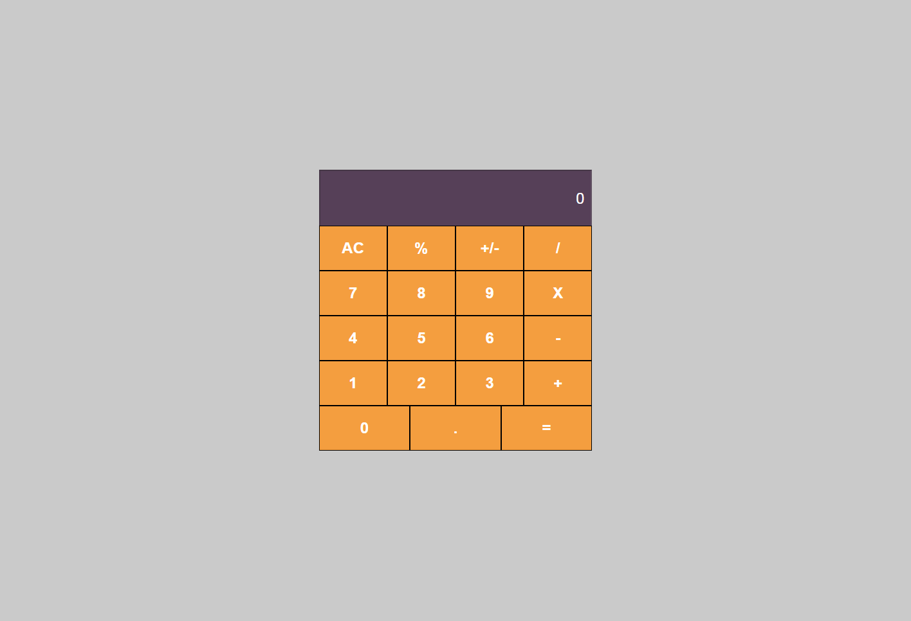

<h1 align="center">Calculadora - React DIO </h1>

O projeto consite na construção de uma aplicação Web baseado em uma cálculadora, utilizando o React e colando em prática a lógica de programação</a>.

## Súmario

- [📦 Temas abordados](#topics)
- [🏆 Sobre](#sobre)

<h2 id="features">✨ Features </h2>

- React
- HTML
- CSS
- JavaScript

<h2 id="sobre">🏆 Sobre</h2>

Como desafio durante foi criado uma calculadora utilizando REACT, buscando coloar em práticas os conceito de Componentes e estado da aplicação. 
